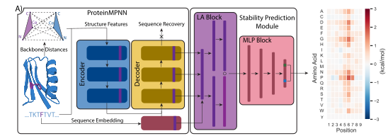

# ThermoMPNN
ThermoMPNN is a graph neural network (GNN) trained using transfer learning to predict changes in stability for protein point mutants.



For details on ThermoMPNN training and methodology, please see the accompanying [paper](https://www.biorxiv.org/content/10.1101/2023.07.27.550881v1). 

## Colab Implementation
For a user-friendly version of ThermoMPNN requiring no installation, use this [Colab notebook](https://colab.research.google.com/drive/1OcT4eYwzxUFNlHNPk9_5uvxGNMVg3CFA#scrollTo=i06A5VI142NT).

## Installation
To install ThermoMPNN, first clone this repository
```
git clone https://github.com/Kuhlman-Lab/ThermoMPNN.git
```
Then use the file ```environment.yaml``` install the necessary python dependencies (I recommend using mamba for convenience):
```
mamba env create -f environment.yaml
```
This will create a conda environment called ```thermoMPNN```.

## GEEF Adapter
This fork adds a lightweight `geef_adapter` package for GEEF-style multi-mutation scoring.

### What it does
Original ThermoMPNN is naturally oriented toward single-mutation stability prediction. The adapter adds a wrapper layer with the following semantics:

- input = WT structure + WT sequence + one or more variant sequences
- each variant is compared against the WT sequence
- all substitutions are decomposed into single mutations such as `A25V`
- ThermoMPNN scores each single mutation independently
- the final variant-level `ddg` is computed as the **sum** of all single-mutation `ddg` values

Current limitations:
- substitution only
- no insertions or deletions
- aggregation method currently supports `sum` only

### Main API
The adapter exports:
- `ThermoMPNNConfig`
- `VariantInput`
- `PerMutationScore`
- `VariantScoreResult`
- `ThermoMPNNScorer`

### Quick start
```python
from geef_adapter import ThermoMPNNConfig, ThermoMPNNScorer, VariantInput

config = ThermoMPNNConfig(
    model_path="/absolute/path/to/thermoMPNN_default.pt",
    local_yaml_path="/absolute/path/to/local.yaml",
    device="cuda",
    default_chain_id="A",
    aggregation_method="sum",
    cache_structures=True,
    combine_variant_mutations=True,
)

scorer = ThermoMPNNScorer(config)

variant = VariantInput(
    variant_id="variant_001",
    wildtype_sequence="MSTAGKVIKCKAAVAWEAGKPLSIEEVEVAPPKAHEVRIKMVATGICRSDDHVVSGTLVTPLPNAQNVSVVDLTVRSLGADVVVVATGRARQGADVVVV",
    variant_sequence="MSTAGKVIKCKAAVAWEAGKPLSIEEVEVAPPKAHEVRIKMVATGICRSDDHVVSGTLVTPLPNAQNVSVVDLTVRSLGADVVVVATGRARQGADAVVVV",
    pdb_path="/absolute/path/to/reference_structure.pdb",
    chain_id="A",
)

result = scorer.score_variant(variant)
print(result.status)
print(result.ddg_sum)
print(result.mutation_list)
print(result.per_mutation_scores)
```

### Explicit mutation list validation
If you already know the mutations, you can also pass `mutation_list`.
The adapter will validate that:
- `mutation_list` matches the sequence-derived substitutions
- WT residues agree with `wildtype_sequence`

Example:
```python
variant = VariantInput(
    variant_id="variant_002",
    wildtype_sequence=wt_seq,
    variant_sequence=mut_seq,
    pdb_path="/absolute/path/to/reference_structure.pdb",
    chain_id="A",
    mutation_list=["A25V", "L40F"],
)
```

### Batch scoring
For multiple variants on the same WT structure, use `score_variants()`:
```python
results = scorer.score_variants([variant1, variant2, variant3])
```

When `combine_variant_mutations=True`, the adapter will:
- group variants by `pdb_path + chain_id`
- collect all unique single mutations across that group
- run one merged ThermoMPNN batch for those unique mutations
- map the resulting single-mutation scores back to each variant

This reduces repeated inference when many variants share hotspot substitutions.

### Result structure
A successful `VariantScoreResult` contains:
- `status`
- `ddg_sum`
- `mutation_list`
- `per_mutation_scores`
- `aggregation_method`
- `mutation_count`
- `metadata`

Each item in `per_mutation_scores` contains:
- `mutation`
- `ddg`

### Error handling
If scoring fails, the adapter returns a `VariantScoreResult` with:
- `status="error"`
- `error_type`
- `error_message`

Common failure causes:
- missing PDB file
- WT/variant sequence length mismatch
- explicit `mutation_list` inconsistent with sequence diff
- WT residue mismatch at a mutation site
- ThermoMPNN inference failure

### Smoke test
This fork includes a local smoke test script:
- `examples/geef_variant_test.py`

Run it inside the ThermoMPNN environment after updating the PDB path in the script:
```bash
cd ThermoMPNN-1.0.0
conda run -n thermoMPNN python examples/geef_variant_test.py
```

## Inference
There are a few different ways to run inference with ThermoMPNN all located in the ```analysis``` directory.

### From a PDB
The simplest way is to use the ```custom_inference.py``` script to pass a custom PDB to ThermoMPNN for site-saturation mutagenesis.

### From a CSV and many PDBs
For larger batches of predictions, it is recommended to set up a **CustomDataset** object by inheriting from the **ddgBenchDataset** class in the ```datasets.py``` file, then add this dataset to the ```SSM.py``` script to get aggregated predictions for the whole dataset.

### For benchmarking purposes
The ```thermompnn_benchmarking.py``` is set up to score different models on a **CustomDataset** object or one of the datasets used in this study. An example inference SLURM script is provided at ```examples/inference.sh```.

## Training
The main training script is ```train_thermompnn.py```. To set up a training run, you must write a ```config.yaml``` file (example provided) to specify model hyperparameters. You also must provide a ```local.yaml``` file to tell ThermoMPNN where to find your data. These files serve as experiment logs as well.

Training ThermoMPNN requires the use of a GPU. On a small dataset (<5000 data points), training takes <30s per epoch, while on a mega-scale dataset (>200,000 data points), it takes 8-12min per epoch (on a single V100 GPU). An example training SLURM script is provided at ```examples/train.sh```.

### Splits and Model Weights
For the purpose of replication and future benchmarking, the dataset splits used in this study are included as ```.pkl``` files under the ```dataset_splits/``` directory.

ThermoMPNN model weights can be found in the ```models/``` directory. The following model weights are provided:
```
- thermoMPNN_default.pt (best ThermoMPNN model trained on Megascale training dataset)
```

### Dataset Availability
The datasets used in this study can be found in the following locations:

Fireprot: https://doi.org/10.5281/zenodo.8169288
Megascale: https://doi.org/10.5281/zenodo.7401274
S669: https://doi.org/10.1093/bib/bbab555
SSYM, P53, Myoglobin, etc: https://protddg-bench.github.io
